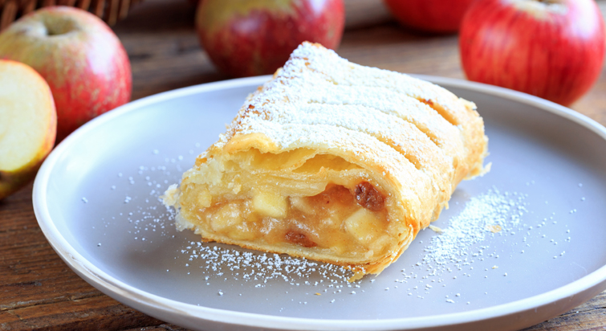

# 🍰 Bake With Sahil

A visually appealing and responsive recipe website that showcases a collection of delicious desserts like Apple Strudel, Crème Caramel, Éclair, and more — built using HTML and CSS.



---

## 📌 Features

- ✅ Clean and responsive layout
- ✅ Interactive image overlays with hover effects
- ✅ Modern UI using Flexbox and gradients
- ✅ Mobile-friendly design with media queries
- ✅ Click-to-Buy call-to-action for each dessert

---

## 🛠️ Built With

- HTML5
- CSS3
- Visual Studio Code

---

## 📁 Project Structure

bake-with-sahil/
├── a.html # Main HTML file

├── a.css # CSS styles

├── Apple-strudel.jpg # Images

├── Bostock.jpg

├── creme-caramel.jpg

├── Eclair.jpg

├── kitkat truffle.webp

├── Molten-Lava-Cake.jpg

├── Paris-Brest.jpg

└── .git/ # Git repo data

---

## 🚀 Getting Started

To run this project locally:

1. Clone the repo:
   ```bash
   git clone  https://github.com/sahilkh4n7/BakeWithSahil.git
   cd BakeWithSahil
2. Open a.html in your browser:

You can double-click it, or

Use Live Server in VS Code

🌐 View Live
Coming soon on GitHub Pages:
https://sahilkh4n7.github.io/bake-with-sahil/

🙌 Acknowledgements
This project was built as part of a front-end learning journey to improve HTML/CSS skills. Inspired by classic desserts and elegant design.

📬 Contact
Have suggestions or feedback? Reach out:

GitHub: @sahilkh4n7
